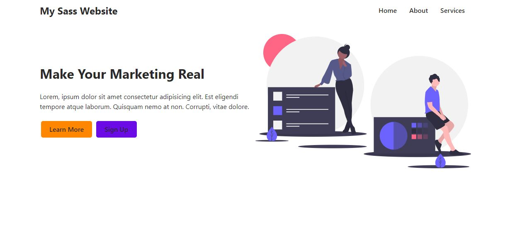
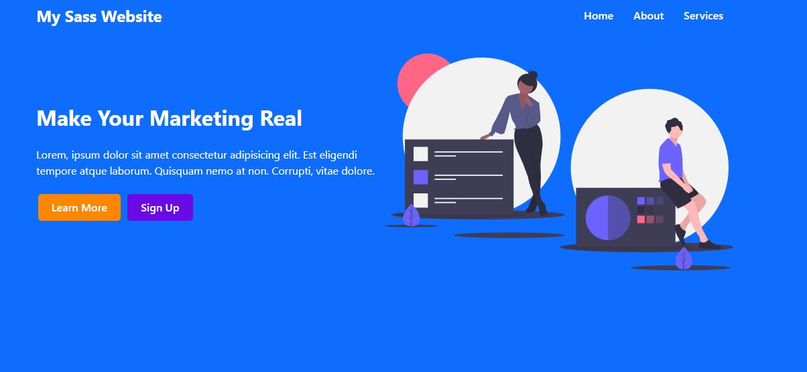

# Sass-website

**SASS** : Synatically awesome stylesheet

* CSS PreProcessor / Extension
* Use the feature that do not exist in CSS
* SASS file are compiled to regular CSS

**Features of scss** :

1. Provide a variable declaration
2. Nesting property
3. Modules 
4. Mixing and function
5. Inheritance 
6. Operator 
7. Conditional property

_Get free SVG from [Here](https://undraw.co/search)_

**Pre-requisite** :
```javascript
$ npm install -g scss
```

**Two ways to do run your sass** :

```javascript
1. $ sass --watch scss/style.css css/style.css
```

2. *Install **live sass** extension from vs-code and add configuration in settings.json*
```javascript
        "liveSassCompile.settings.formats":[
        // This is Default.
        {
            "format": "expanded",
            "savePath": "/css"
        }
        ],
        "liveSassCompile.settings.generateMap":false,
```

* When you create **_filename.scss** it will not compiled to .css because it's partial file so,
  you can store your define variable in that file and import that file any where you required .
* we can access or shared property of one scss file to another .

**Theme** :

```css
$primary-color: #ffffff;
```

**Rendered ui**
<div align="center">
        
</div>

```css
$primary-color: #0e6cff;
```

**Rendered ui**
<div align="center">
        
</div>